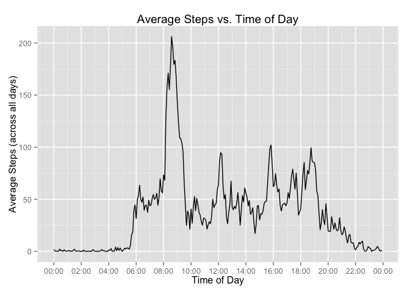

# Reproducible Research: Peer Assessment 1


## Loading and preprocessing the data
1. The following code loads the data into the `activity` dataframe.

```r
library(dplyr, warn.conflicts=FALSE)
library(ggplot2)
library(scales)
activity <- read.csv("activity.csv")
```

2. Use `activity$interval` (hhmm) to create a `tod` variable (time on epoch day 1) which will be useful for interval displays.

```r
activity$tod <- ISOdate(year=1970, month=1, day=1,
    hour=activity$interval %/% 100,
    min=activity$interval %% 100)
```


## What is mean total number of steps taken per day?
1. This histogram plots the frequency of total number of steps taken each day, which is calculated and stored in `stepsByDate`.  Per the instructions, missing values in `activity` are *ignored*.  Rather than using the default binwidth of `diff(range(stepsByDate$totsteps))/30` (705.1), a more natural `bwidth` of 500 is used.

```r
stepsByDateData <- function(dfActivity) {
  na.omit(dfActivity) %>% group_by(date) %>% summarise(totsteps=sum(steps))
}

stepsByDateHistogram <- function(stepsByDate, title) {
  #bwidth <- diff(range(stepsByDate$totsteps)) / 30
  bwidth <- 500
  ggplot(data=stepsByDate, aes(x=totsteps)) +
    geom_histogram(binwidth=bwidth) +
    ggtitle(title) +
    xlab(paste0("steps/day (binwidth=", bwidth, ")"))
}

stepsByDate <- na.omit(activity) %>% group_by(date) %>% summarise(totsteps=sum(steps))
#bwidth <- diff(range(stepsByDate$totsteps)) / 30
bwidth <- 500
ggplot(data=stepsByDate, aes(x=totsteps)) +
    geom_histogram(binwidth=bwidth) +
    ggtitle("Frequency of Steps per Day") +
    xlab(paste0("steps/day (binwidth=", bwidth, ")"))
```

 

2. The (integer) mean and median total number of steps taken per day are calculated with this code:

```r
stepsMean <- mean(stepsByDate$totsteps)
stepsMedian <- as.integer(median(stepsByDate$totsteps))
```
The mean is `1.0766189\times 10^{4}` and the median is `10765`.


## What is the average daily activity pattern?
1. This time series plot has the 5-minute interval (x-axis) and the average number of steps taken, averaged across all days (y-axis).  Missing values in `activity` are ignored.  As a reader aid, interval values have been converted to time of day in `activity$tod`.

```r
stepsByTimeOfDay <- na.omit(activity) %>%
    group_by(tod, interval) %>%
    summarise(totsteps=mean(steps))
ggplot(data=stepsByTimeOfDay, aes(x=tod, y=totsteps)) +
    geom_line() +
    ggtitle("Average Steps vs. Time of Day") +
    xlab("Time of Day") +
    scale_x_datetime(labels=date_format("%H:%M"),
                     breaks=date_breaks("2 hour")) +
    ylab("Average Steps (across all days)")
```

 

2. The following code determines which 5-minute interval, on average across all the days in the dataset, contains the maximum number of steps.

```r
maxStepsIndex <- which.max(stepsByTimeOfDay$totsteps)
maxSteps <- as.integer(stepsByTimeOfDay[maxStepsIndex, "totsteps"])
maxStepsInterval <- stepsByTimeOfDay[maxStepsIndex, "interval"]
maxStepsTimeOfDay <- format(stepsByTimeOfDay[maxStepsIndex, "tod"], format="%H:%M")
```
The maximum number of steps (206) occurs at time period `835` (08:35).


## Imputing missing values
1. The following calculates the total number of rows in `activity` containing NAs ...

```r
numNA <- sum(is.na(activity$steps))
```
The number of NA rows is `2304`.

2. My strategy to fill in all missing (NA) values in the dataset is to use the **mean for that 5-minute interval**.

3. The code below shows how the new `imputedActivity` dataset is created from `activity`, where NA `steps` values are replaced by the mean for that 5-minute interval, which was previously determined in the `stepsByTimeOfDay` dataframe.

```r
imputed.activity <- activity
for (i in 1:nrow(imputed.activity)) {
  if (is.na(imputed.activity[i, "steps"])) {
    interval <- imputed.activity[i, "interval"]
    imputedSteps <- stepsByTimeOfDay[stepsByTimeOfDay$interval==interval, "totsteps"]
    imputed.activity[i, "steps"] <- imputedSteps
  }
}
```

4. Make a histogram of the total number of steps taken each day and Calculate and report the mean and median total number of steps taken per day. Do these values differ from the estimates from the first part of the assignment? What is the impact of imputing missing data on the estimates of the total daily number of steps?

```r
imputed.stepsByDate <- stepsByDateData(imputed.activity)
stepsByDateHistogram(imputed.stepsByDate, "Frequency of (Imputed) Steps per Day")
```

 

```r
imputedNumNA <- sum(is.na(imputed.activity$steps))
```
The number of NA rows is `0`.

this code:

```r
imputed.stepsMean <- mean(imputed.stepsByDate$totsteps)
imputed.stepsMedian <- as.integer(median(imputed.stepsByDate$totsteps))
```
The mean is `1.0766189\times 10^{4}` and the median is `10766`.


## Are there differences in activity patterns between weekdays and weekends?
